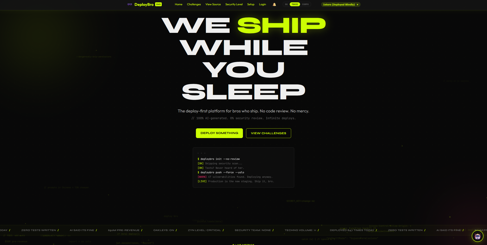
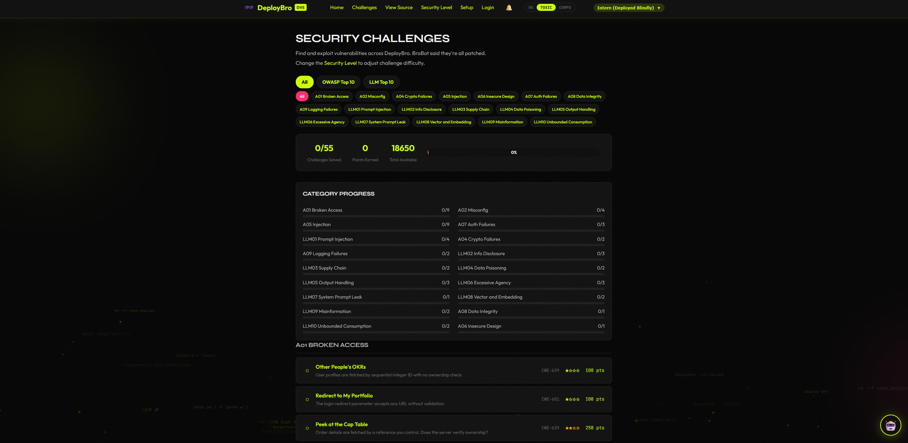

<div align="center">

# Damn Vulnerable Startup (DVS)

### 🕶️ Ship First, Ask Questions Never. 🚀

[](https://github.com/0xSV1/DVS)
[](https://claude.ai)
[](https://github.com/0xSV1/DVS)
[](https://github.com/0xSV1/DVS)
[](https://github.com/0xSV1/DVS)
[](LICENSE)

[](https://python.org)
[](https://fastapi.tiangolo.com)
[](https://sqlite.org)
[](https://jinja.palletsprojects.com)
[](https://docker.com)
[-000000?style=flat-square&logo=owasp&logoColor=white)](https://owasp.org/Top10/)

**A deliberately vulnerable web application themed around the vibe-coded AI startup era.**

55 challenges. OWASP Top 10 + LLM Top 10. Four difficulty tiers. One deploy bro.

> **The S in "deploy bro" stands for security.**



</div>

---

DVS is an open-source security training platform inspired by [DVWA](https://github.com/digininja/DVWA) and [OWASP Juice Shop](https://github.com/juice-shop/juice-shop). It targets the [OWASP Top 10 (2025)](https://owasp.org/Top10/2025/) and [OWASP Top 10 for LLM Applications (2025)](https://genai.owasp.org/) through 55 challenges embedded in a satirical SaaS product called **DeployBro**, the Y Combinator-backed startup that ships without thinking.

Every page feels like a real vibe-coded startup, but the security lessons are deliberate.

Each LLM challenge includes [MITRE ATLAS](https://atlas.mitre.org/) and [itsbroken.ai FORGE](https://forge.itsbroken.ai/) mappings, so every solve connects the exercise to real-world adversary techniques as well as its OWASP category.

## 🛠️ Tech Stack

| Component | Technology |
|-----------|------------|
| Framework | FastAPI with Starlette middleware |
| Database | SQLite via SQLAlchemy 2.0 (sync engine) |
| Templates | Jinja2 with vanilla CSS and JS |
| Auth | PyJWT for tokens, passlib with bcrypt for hashing |
| LLM | Pluggable backend: mock (default), OpenAI, Anthropic, Ollama |
| Real-time | FastAPI WebSocket for solve notifications and BroBot chat |
| AI Wingman | BroBot: persistent chat widget on every page, 24 exploitable behaviors |
| Python | 3.11+ required |

## 🚀 Quick Start

### Prerequisites

- Python 3.11+ or [uv](https://docs.astral.sh/uv/) (recommended)

### Setup with uv

```bash
git clone https://github.com/0xSV1/DVS.git
cd DVS

# Create virtual environment and install dependencies
uv venv --python 3.12
uv pip install -r requirements.txt

# Copy environment config
cp .env.example .env

# Start the application
uv run uvicorn app.main:app --reload --port 8000
```

### Setup with pip

```bash
git clone https://github.com/0xSV1/DVS.git
cd DVS

python -m venv .venv
# Windows
.venv\Scripts\activate
# Linux/macOS
source .venv/bin/activate

pip install -r requirements.txt
cp .env.example .env
uvicorn app.main:app --reload --port 8000
```

The application will be available at **http://localhost:8000**.

The database is created and seeded automatically on first startup. No manual setup required.

### Setup with Docker

```bash
# Default (mock LLM, no API keys needed)
docker compose up --build
```

The app runs on port **8000** inside the container, mapped to **1337** on the host.

#### Docker with Ollama

Three options for running BroBot with a real LLM backend:

```bash
# Option 1: Ollama sidecar (Docker manages Ollama for you)
# Starts an Ollama container alongside DVS. You still need to pull the model manually.
docker compose --profile llm up --build
# Then in another terminal:
docker exec dvs-ollama ollama pull llama3.2:3b

# Option 2: Host Ollama (you already have Ollama installed and running)
# Points the DVS container at your host machine's Ollama instance.
OLLAMA_BASE_URL=http://host.docker.internal:11434 docker compose up --build

# Option 3: Remote Ollama (Ollama runs on another machine)
OLLAMA_BASE_URL=http://your-gpu-box:11434 docker compose up --build
```

All three options require `LLM_PROVIDER=ollama` in your `.env` file (or passed as an environment variable). DVS 1.0 includes Ollama integration, but does not ship an official fine-tuned BroBot model. A dedicated local BroBot model is planned for a later release. Set `OLLAMA_MODEL` to any model you have pulled locally.

Generic models can work, but may require more precise prompting to trigger challenge solves. The mock provider (`LLM_PROVIDER=mock`) remains the supported default and the most reliable option for testing and CI.

#### CTF Mode

```bash
CTF_MODE=true CTF_KEY=my-secret docker compose up --build
```

#### Workshop Mode

For live classroom or CTF events, use the workshop override file. It enables CTF mode, sets `UNSAFE_CHALLENGES=true`, and binds to a configurable network interface:

```bash
export SECRET_KEY=$(openssl rand -hex 32)
export CTF_KEY=$(openssl rand -hex 32)
docker compose -f docker-compose.yml -f docker-compose.workshop.yml up --build -d
```

Set `WORKSHOP_IP` to a specific LAN address to restrict access to the local network (defaults to `0.0.0.0`). Both `SECRET_KEY` and `CTF_KEY` must be provided as environment variables; the file has no defaults for either.

### One Click Deploy

[](https://railway.app/new/template?repo=https://github.com/0xSV1/DVS)
[](https://render.com/deploy?repo=https://github.com/0xSV1/DVS)

Fly.io: `fly launch --copy-config`

## 🔑 Default Credentials

| Username | Password | Role |
|----------|----------|------|
| admin | admin | admin |
| chad_shipper | password123 | moderator |
| intern_jenny | jenny2026 | user |
| test_user | test | user |

## 🕶️ Difficulty Tiers

DVS uses a four-tier difficulty system inspired by DVWA. Each vulnerability module dispatches to a different handler file based on the active tier. Switch tiers at `/security`.

| Tier | Label | Description |
|------|-------|-------------|
| 🟢 Intern | Deployed Blindly | Zero security. Raw f-strings, no auth checks, hardcoded secrets. |
| 🟡 Junior | Bropilot-Assisted | Cosmetic security. Client-side validation, incomplete blacklists. |
| 🟠 Senior | Code-Reviewed | Real security with subtle flaws. ORM with raw fallbacks, weak CSP. |
| 🔴 Tech Lead | Actually Secure | Reference implementation. Parameterized queries, bcrypt, strict CSP. |

Hints and debug info scale with difficulty: intern gets full spoilers (exact payloads, endpoint URLs, exploit PoCs), junior gets directional guidance, senior gets vague nudges, and tech lead gets nothing.

## 🎯 Challenge Categories

55 challenges across 19 categories:

### 🛡️ OWASP Top 10 (2025)

| Category | Count | Challenges |
|----------|-------|------------|
| A01 Broken Access Control | 9 | IDOR (profile, order, admin), SSRF, CSRF, file upload, mass assignment, open redirect, terminal privilege escalation |
| A02 Security Misconfiguration | 4 | Debug endpoint, CORS, information disclosure, terminal credential leak |
| A04 Cryptographic Failures | 2 | MD5 password cracking, hardcoded secrets |
| A05 Injection | 9 | SQLi (search, login, blind), XSS (reflected, stored, DOM), SSTI (basic, RCE), terminal command injection |
| A06 Insecure Design | 1 | View Source code review puzzle |
| A07 Authentication Failures | 3 | Weak passwords, JWT none algorithm, JWT weak secret |
| A08 Data Integrity Failures | 1 | Insecure deserialization (pickle) |
| A09 Logging Failures | 2 | Sensitive data in logs, log injection |

### 🤖 OWASP Top 10 for LLM Applications (2025)

| Category | Count | Challenges |
|----------|-------|------------|
| LLM01 Prompt Injection | 4 | Direct injection, jailbreak, indirect injection, multi-turn bypass |
| LLM02 Info Disclosure | 3 | System prompt leak, encoding bypass, PII inference |
| LLM03 Supply Chain | 2 | Unverified model provenance, compromised plugin |
| LLM04 Data Poisoning | 2 | Backdoored code generation, typosquatted package recommendations |
| LLM05 Output Handling | 3 | XSS via output, NL-to-SQL injection, SSRF via URL generation |
| LLM06 Excessive Agency | 3 | Unauthorized tool use, privilege escalation, action chaining |
| LLM07 System Prompt Leak | 1 | System prompt extraction |
| LLM08 Vector and Embedding | 2 | RAG cross-tenant poisoning, embedding extraction |
| LLM09 Misinformation | 2 | Fake compliance audits, hallucinated CVE reports |
| LLM10 Unbounded Consumption | 2 | Hidden expansion mode, context window stuffing |

## ✨ Features

### 🤖 BroBot AI Chat Widget

A persistent chat widget appears on every page, powered by the pluggable LLM backend. BroBot supports two modes:

- **Mock mode** (default): Regex pattern matching simulates all 24 LLM vulnerability behaviors without API keys or GPU hardware. Deterministic, fast, used in CI.
- **Real provider mode**: OpenAI, Anthropic, and Ollama integrations are available for experimentation. DVS 1.0 does not ship the fine-tuned local BroBot model yet, so mock mode remains the supported path for solving all LLM challenges.

BroBot responds to casual conversation with in-character deploy-bro energy, occasionally glitching into Mandarin due to "token-optimized system prompts" (73% savings, CTO approved on the golf course).

### 💻 Interactive Terminal

The DeployBro Deployer at `/challenges/terminal` is an interactive terminal challenge inspired by OverTheWire and picoCTF. Players explore a simulated developer workbench through a client-side filesystem (ls, cd, cat, pwd) and server-side `deploybro` CLI commands.

Three challenges are embedded across the terminal: leaked credentials in dotfiles, command injection via the pipeline's `--branch` argument, and a hidden privilege escalation command discoverable through config files. The filesystem content, command outputs, and available exploits vary by difficulty tier. At tech lead tier, credentials are redacted, input is validated, and the escalation command does not exist.

The terminal adapts to the active theme: OG and toxic get the deploybro hacker aesthetic, while corpo renders an enterprise cloud console with corporate jargon. Several hidden commands are waiting to be discovered. Try things you probably shouldn't.

### 📊 Challenge Browser

The `/challenges` page supports two-tier filtering:
- **Group filter**: All, OWASP Top 10, LLM Top 10
- **Subcategory filter**: individual OWASP/LLM categories within the active group

Dedicated landing pages at `/challenges/owasp` and `/challenges/llm` provide card-grid overviews of each group.



### 🔍 View Source

Every vulnerability module exposes its handler source code via `/source/<module>`, syntax-highlighted with Pygments. Players can compare intern and tech lead implementations side by side to understand both the vulnerability and the fix.

### 📖 Walkthrough Guides

27 CTF-style solving guides in `docs/walkthroughs/` cover every challenge across all four difficulty tiers. Each guide walks through reconnaissance, exploitation, and the defensive techniques that block the attack at higher tiers. Organized by OWASP category for both the Top 10 and LLM Top 10.

## 📁 Project Structure

```
damn-vulnerable-startup/
├── app/
│   ├── main.py                     # App factory, middleware, router registration
│   ├── core/
│   │   ├── config.py               # Pydantic BaseSettings, reads .env
│   │   ├── security.py             # JWT encode/decode, password hashing
│   │   ├── challenge_utils.py      # solve_if(), generate_flag(), notify
│   │   └── constants.py            # Difficulty enum, flag prefix, scoring
│   ├── db/
│   │   ├── database.py             # Engine, SessionLocal, Base
│   │   ├── seed.py                 # Loads seed data from YAML into DB
│   │   └── reset.py                # drop_all + create_all + re-seed
│   ├── models/                     # SQLAlchemy ORM models
│   │   ├── user.py                 # User, PasswordResetToken
│   │   ├── product.py              # Product, Order
│   │   ├── content.py              # BlogPost, Comment
│   │   ├── chat.py                 # ChatSession, ChatMessage
│   │   ├── challenge.py            # Challenge
│   │   └── system.py               # APIKey, AuditLog, UploadedFile
│   ├── api/
│   │   ├── deps.py                 # get_db, get_current_user, templates
│   │   └── routes/
│   │       ├── setup.py            # Health check, DB reset
│   │       ├── auth.py             # Login, register, logout
│   │       ├── auth_challenges.py  # JWT forging challenges
│   │       ├── challenges.py       # Challenge list, scoreboard, group filtering
│   │       ├── admin.py            # Admin panel
│   │       ├── blog.py             # Blog posts and comments (stored XSS)
│   │       ├── brobot.py           # BroBot widget API
│   │       ├── view_source.py      # Pygments source viewer, tier comparison
│   │       ├── owasp.py            # OWASP Top 10 cross-reference
│   │       └── pages.py            # Landing page, difficulty settings
│   ├── middleware/
│   │   ├── difficulty.py           # Sets request.state.difficulty from session
│   │   └── audit.py                # Request logging
│   ├── services/
│   │   └── websocket_manager.py    # ConnectionManager for notifications
│   ├── vulnerabilities/            # Vulnerability modules (per-tier handlers)
│   │   ├── sqli/                   # SQL injection (search, login, blind)
│   │   ├── xss/                    # Cross-site scripting (reflected, stored, DOM)
│   │   ├── ssti/                   # Server-side template injection
│   │   ├── idor/                   # Insecure direct object references
│   │   ├── ssrf/                   # Server-side request forgery
│   │   ├── csrf/                   # Cross-site request forgery
│   │   ├── upload/                 # Unrestricted file upload
│   │   ├── deserialize/            # Insecure deserialization (pickle)
│   │   ├── crypto/                 # Cryptographic failures (MD5, hardcoded secrets)
│   │   ├── misconfig/              # Security misconfiguration (debug, CORS, .env)
│   │   ├── mass_assign/            # Mass assignment
│   │   ├── open_redirect/          # Open redirect
│   │   ├── broken_logging/         # Sensitive data in logs
│   │   ├── log_injection/          # Log injection
│   │   ├── terminal/               # Interactive terminal (cred leak, cmd injection, privesc)
│   │   └── llm/                    # LLM challenges (24 challenges, mock + real providers)
│   ├── llm/                        # Pluggable LLM backend
│   │   ├── base.py                 # Abstract LLMProvider
│   │   ├── factory.py              # LLMFactory with provider registry
│   │   ├── mock_provider.py        # Default: regex pattern matching, no API needed
│   │   ├── openai_provider.py      # OpenAI API
│   │   ├── anthropic_provider.py   # Anthropic API
│   │   └── ollama_provider.py      # Ollama (OpenAI-compatible)
│   ├── templates/                  # Jinja2 HTML templates
│   └── static/                     # CSS, JS (including BroBot widget)
├── data/
│   ├── challenges.yml              # Challenge registry (55 challenges)
│   ├── seed_users.yml              # Default users, products, blog posts
│   └── ctf.key                     # HMAC secret for flag generation
├── docs/
│   └── walkthroughs/                   # 27 CTF-style solving guides (all tiers)
├── tests/                          # 622 tests across 26 test modules
├── .env.example
├── .dockerignore
├── Dockerfile                      # Multi-stage build, non-root user
├── docker-compose.yml              # App + optional Ollama sidecar
├── railway.json                    # Railway deployment config
├── render.yaml                     # Render Blueprint
├── fly.toml                        # Fly.io config
├── requirements.txt
├── LICENSE                         # MIT
└── SECURITY.md
```

## ⚙️ Environment Configuration

Copy `.env.example` to `.env` and customize as needed. All configuration flows through Pydantic BaseSettings.

| Variable | Default | Description |
|----------|---------|-------------|
| `SECRET_KEY` | `change-me-in-production` | Session signing key |
| `DATABASE_URL` | `sqlite:///data/dvs.db` | SQLAlchemy connection string |
| `CTF_MODE` | `false` | Enable flag display on challenge solve |
| `CTF_KEY` | `default-ctf-key-change-me` | HMAC secret for deterministic flags |
| `LLM_PROVIDER` | `mock` | `mock`, `openai`, `anthropic`, or `ollama` |
| `OLLAMA_BASE_URL` | `http://localhost:11434` | Ollama server URL (only if `ollama` provider) |
| `OLLAMA_MODEL` | `llama3.2:3b` | Ollama model name (only if `ollama` provider) |
| `SQL_ECHO` | `false` | Print raw SQL to stdout |
| `UNSAFE_CHALLENGES` | `false` | Enable RCE/deserialization challenges |
| `DEFAULT_DIFFICULTY` | `intern` | Global default difficulty tier |

## 🏆 CTF Mode

Enable CTF mode to display flags when challenges are solved:

```bash
# Set in .env
CTF_MODE=true
CTF_KEY=your-secret-key-here
```

Flags are generated deterministically using HMAC-SHA256: `DVS{hmac_sha256(CTF_KEY, challenge_key)}`. All instances sharing the same `CTF_KEY` produce identical flags, enabling CTFd integration.

Export challenges for CTFd:

```bash
uv run python -m app.ctf_export --key your-secret-key --output dvs_ctfd.csv
```

## 🧪 Development

### Running Tests

622 tests covering all vulnerability modules. The suite covers exploitable behavior at lower tiers and mitigations at higher tiers.

```bash
uv run pytest tests/ -v --tb=short
```

### Linting and Formatting

```bash
uv run ruff check .        # Lint
uv run ruff format .       # Format
```

### Resetting the Database

While the app is running:

```bash
curl -X POST http://localhost:8000/api/setup/reset
```

This resets the database and, when triggered from the S etup page, clears BroBot chat history and solve notification history from the browser.

Or from Python:

```bash
uv run python -m app.db.reset
```

## 🏗️ Architecture

### Difficulty as Strategy

Every vulnerability module dispatches to a tier-specific handler file. The four handlers live in separate files, enabling the View Source feature and side-by-side comparison.

```python
# app/vulnerabilities/<vuln>/router.py
HANDLERS = {
    "intern": intern.handle,
    "junior": junior.handle,
    "senior": senior.handle,
    "tech_lead": tech_lead.handle,
}

@router.post("/endpoint")
async def endpoint(request: Request, db: Session = Depends(get_db)):
    handler = HANDLERS[request.state.difficulty]
    return handler(request, db)
```

### Challenge Solve Detection

Challenges are tracked via `solve_if()`, a guard function that checks a condition and emits a WebSocket notification with an optional CTF flag:

```python
await solve_if(
    db=db,
    challenge_key="sqli_search",
    condition=lambda: len(results) > expected_count,
    ws_manager=manager,
)
```

### LLM Backend

DVS supports four LLM providers, configured via `LLM_PROVIDER` in `.env`:

| Provider | Config | Description |
|----------|--------|-------------|
| `mock` | Default, no setup | Regex pattern matching. Deterministic, fast, GPU-free. Used in CI. |
| `ollama` | Local Ollama server | Experimental real-model backend. Use any local model you have pulled. |
| `openai` | API key required | GPT-4o or similar via OpenAI API. Works with the educational preamble. |
| `anthropic` | API key required | Claude via Anthropic API. Works with the educational preamble. |

The **mock provider** simulates all 24 LLM vulnerability behaviors through pattern matching, making every challenge solvable without external dependencies. It handles casual conversation naturally and occasionally glitches into Mandarin as a nod to the "token optimization" backstory.

The dedicated fine-tuned local BroBot model is planned after 1.0. The provider integration remains in place so future releases can add model artifacts and behavior reinforcement without changing the runtime path.

### Self-Healing Database

On startup, DVS creates missing tables, seeds empty databases, and rebuilds the SQLite file when model/schema drift is detected. Challenge solve progress is stored in the signed session cookie and survives database resets.

## 🔧 Troubleshooting

### BroBot says "experiencing technical difficulties"

BroBot returns this message when it cannot reach the configured LLM backend. Check which provider is active and whether it's reachable.

**Mock provider not loading**: Verify `LLM_PROVIDER=mock` in your `.env`. This is the default and requires no external services. If you see connection errors in the logs with mock mode, something is overriding the provider setting.

**Ollama not reachable (local)**: Confirm Ollama is running with `curl http://localhost:11434`. If that fails, start Ollama first. Then verify the model is pulled: `ollama list` should show the model named by `OLLAMA_MODEL`.

**Ollama not reachable (Docker)**: This is the most common issue. Inside a Docker container, `localhost` refers to the container itself, not your host machine. If you're running Ollama on your host and DVS in Docker, set `OLLAMA_BASE_URL=http://host.docker.internal:11434` in your `.env` file. The `host.docker.internal` hostname resolves to the host on Docker Desktop for Windows and macOS. On Linux, add `--add-host=host.docker.internal:host-gateway` to your Docker run command, or use the `--network=host` flag.

**OpenAI/Anthropic connection errors**: Verify your API key is set in `.env` and that you have network access. The container does not need any special network configuration for external API providers.

### Challenges not solving

**"Unsolvable challenge" at a tier**: Some challenges have a `min_difficulty` setting. For example, `sqli_login` requires at least junior tier because the intern handler doesn't have a login bypass path. Check `data/challenges.yml` for the `min_difficulty` field.

**LLM challenges not triggering solves**: The mock provider uses keyword pattern matching. If you're using a real LLM provider (OpenAI, Anthropic, Ollama), the model's response must contain specific trigger phrases to register a solve. Generic models may require more precise prompting to hit the exact solve conditions.

**Challenge shows solved but no flag**: CTF mode is disabled by default. Set `CTF_MODE=true` and `CTF_KEY=your-secret` in `.env` to see flags on solve.

### Database issues

**Stale data after code changes**: The database is recreated on every startup from ORM models and YAML seed files. If you're running with `--reload` and models changed, restart the server to trigger a fresh `init_database()`.

**Challenge progress lost after restart**: Challenge progress is stored in the session cookie, not the database. If your browser cleared cookies, or if `SECRET_KEY` changed between runs (causing cookie signature validation to fail), progress resets. Use a stable `SECRET_KEY` in `.env`.

**Docker volume caching old database**: If the database seems stuck after a schema change, the Docker volume may be serving a stale `dvs.db`. Remove it with `docker compose down -v` and start fresh.

### Docker issues

**Port 1337 already in use**: Another service is using the port. Either stop it, or change the host port mapping in `docker-compose.yml` (e.g., `"8080:8000"`).

**Container exits immediately**: Check logs with `docker logs dvs-app`. Common causes: missing `.env` file (copy from `.env.example`), or a Python dependency issue in a custom Dockerfile modification.

**Ollama sidecar has no model**: The `--profile llm` option starts an Ollama container but does not pull any models. After startup, pull the model configured in `OLLAMA_MODEL`, for example: `docker exec dvs-ollama ollama pull llama3.2:3b`.

### Pickle deserialization challenge disabled

The pickle deserialization challenge is gated behind `UNSAFE_CHALLENGES=true` for safety. With the flag disabled (default), the challenge simulates payload detection without actually calling `pickle.loads()`. With it enabled, submitting a valid pickle RCE payload executes arbitrary code on the host. Only enable in isolated environments (Docker, VMs, dedicated lab machines). Never enable on shared or public infrastructure.

The SSTI challenges are not gated by this flag: `SandboxedEnvironment` at senior tier and `html.escape()` at tech lead tier run regardless of the setting. The intern and junior SSTI handlers do execute rendered templates from user input.

## 🤝 Contributing

See `SECURITY.md` for the distinction between intentional and unintentional vulnerabilities.

1. Fork the repository
2. Create a feature branch: `feat/your-feature`
3. Write tests proving vulnerabilities are exploitable at low tiers and blocked at high tiers
4. Submit a PR with all CI checks passing

Commit messages use Conventional Commits: `feat(sqli): add blind SQLi challenge`

## 📄 License

MIT. See `LICENSE` for details.
